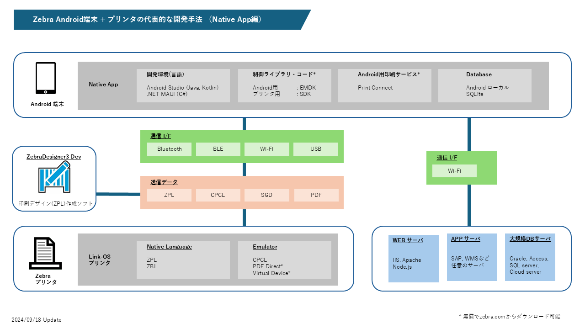
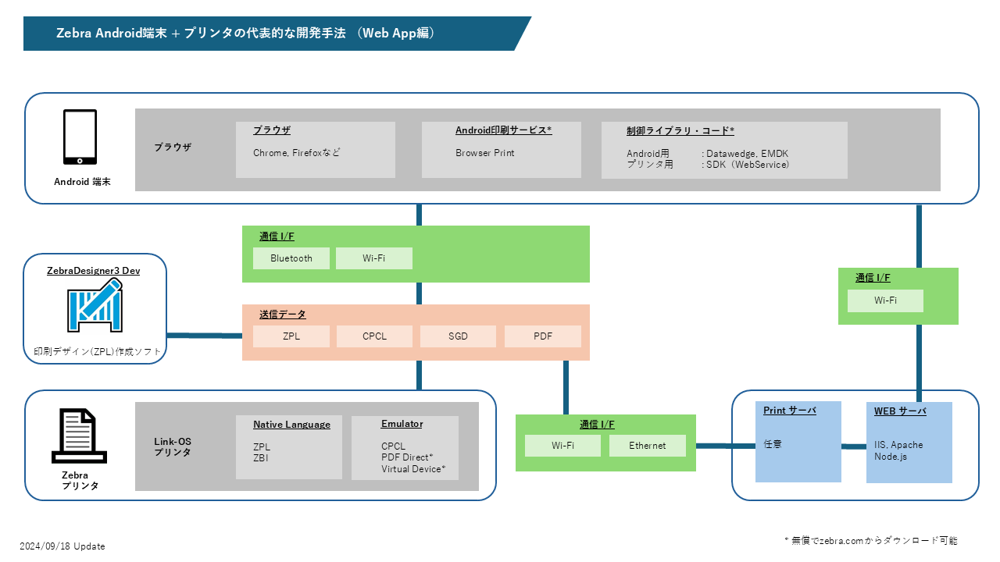

### Zebraプリンタ向けアプリをZebra Android端末で開発する人向けの早見ガイド

Zebra Android 端末上の印刷アプリケーションを開発を始めるにあたって、必要なマテリアルや手法についての質問が多いため作成。
 
 

#### Native App開発

 
Native App開発時はLink-OS Multiplatform SDKを用いて開発する方が多い。特に開発者が印刷アプリ開発知見が無い場合、その傾向が顕著である。Zebra のSDKはZebraDesigner 3 Developerと併せて利用することで印刷周りについての学習コストを低くできることが魅力。

印刷機能の開発コスト・期間を最小化したい方向けにZebra からPrint Connectが用意されている。これはAndroid上で動作するWindows 印刷ドライバのような働きをするため、開発者はプリンタとの連携についてあまり意識をせずにコード開発が可能。

Android側の機能開発についても強力なEMDKやDatawedgeが用意されているため、高度なアプリ開発でなければ苦労することはないと思われる。

[Zebra Developers: Print Connect](https://developer.zebra.com/products/printers/print-connect)

 
 

#### Web App開発

 
Web App開発は印刷指示の出し方が２種類あることに注目。
1. Android端末から印刷指示をする。
1. Print サーバから印刷指示をする。

どちらを選択するかによって、必要なマテリアル、コード、インフラなどが異なる。要件を熟慮した上で適切なものを設定するとよいだろう。

Android端末から印刷指示をする場合は、Browser Printというソリューションが利用可能。これを用いることによって、Android/Browserとプリンタ間の連携処理コードを簡略化できる。Browser PrintはWindows/OSx上でも利用できる人気ソリューション。

[YouTube: Zebra DevTalk | Printing from Browsers on Windows, OSX, and Android™ with Zebra’s Browser Print SDK](https://www.youtube.com/watch?v=LRcd_lyHcX8&pp=ygUTemVicmEgYnJvd3NlciBwcmludA%3D%3D)

 
 

#### 関連資料

[Git-Hub:Shimauma-Giken: 開発関連資料](https://github.com/shimauma-giken?tab=repositories&q=%E9%96%8B%E7%99%BA&type=&language=&sort=)
